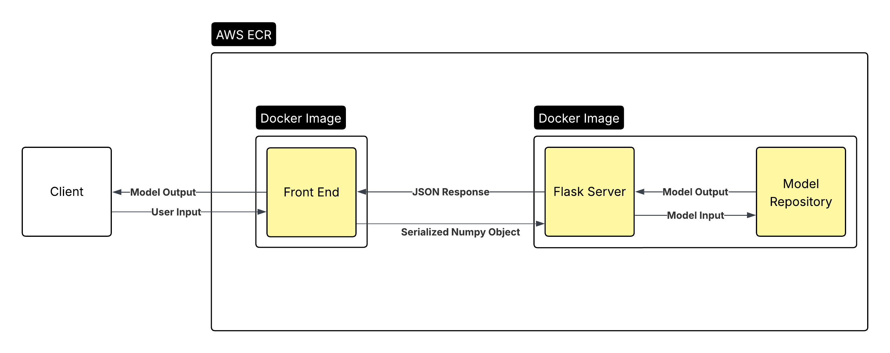

# ML Serving

## About
This repository is a lightweight api for ML model serving. It started out as
a collection of machine learning models implemented from scratch in numpy, built
as an interesting learning exercise, but I decided to take it a little bit further.
I definitely wouldn't recommend using this for anything serious. It's likely to
break! But, it was a great exercise, and if you're interested in learning about
backend infrastructure, feel free to take a look around!

## How it's Built

### Architecture:

Flask backend serving models through various API endpoints. I may or may not
add in a frontend. Originally, I was going to serve from ECS, but I went with
Elastic Beanstalk.

### Flask
Flask is a lightweight python webserver. I've used it before, and there's no
real reason to get any more complicated than this. What's that saying about
doing the easiest option that works?

### Gunicorn
Flask's development server is great, but the makers recommend using a more
robust WSGI server. So, I used Gunicorn. It's my first time using it, but it's
given me no reason to complain so far.

### AWS Elastic Beanstalk (lazy)
I decided to host my service with Elastic Beanstalk because a lot of stuff gets
handled for me (nice). It's set up using IaC with Terraform. That was lowkey
tricky to set up, but I got there eventually. Every time infra is updated,
state gets stored in an S3 bucket. Every time someone pushes a branch to github,
github actions automatically updates the service with the code from that branch.
It's worth noting that this is a terrible and insecure way of doing things.
That's close to the top of the list of improvements I'd like to make.

### Testing
I used pytest. Every model has tests, although the model directory itself 
could use some testing.

### Dependency Management
I discovered poetry at TTD, and it's been awesome. Highly recommend.

### Model Implementation
All models are implemented using pure numpy. I had a lot of fun building them!
Many of the models I had never used or implemented before, so it was a great
opportunity to dig back into the math behind them.

## Machine Learning Methods

| Model                   | Status     |
| :---------------------: | :--------: |
| Linear Regression       | Complete   |
| Logistic Regression     | Complete   |
| Gaussian Naive Bayes    | Complete   |
| Multinomial Naive Bayes | Complete   |
| Perceptron              | Complete   |
| SVM                     | Complete   |
| KNN                     | Complete   |
| K-means                 | Complete   |
| Decision Tree           | Incomplete |
| PCA                     | Incomplete |
| GMM                     | Incomplete |

## Possible Improvements

### Frontend
Just calling an API isn't exactly pleasant, so I'm considering adding a frontend.
Although, this is ultimately a backend-focused project, so I may not.

### Database Layer
This is pretty likely to get done, although I'd like to make some progress on
other projects first. Currently, when a user registers a model, it is just
stored in memory of the machine serving the API. This isn't ideal. In case
of a crash, all of the models would be lost, and having multiple machines
serving becomes impossible. So, there is a lot of value in implementing this.

### Prod/Dev separation
As of right now, anyone can push to a branch and change the production API.
It might be smarter to have a dev API that all of the branches push to. Only the
main branch would be able to push to the prod API.

## Lessons Learned

### Infra as code
This project was my first real exposure to IaC. I learned a lot about how
Terraform works, especially how it works in a "real" environment, like having
a shared terraform state in a remote backend.

## Get Started

1. Clone the github
2. Make a branch
3. Create a virtual environment
4. Install poetry
```
pip install poetry
```
5. Install dependencies
```
poetry install
```
6. Set AWS credentials:
- ```AWS_ACCESS_KEY_ID```
- ```AWS_SECRET_ACCESS_KEY```
- ```AWS_DEFAULT_REGION```
7. Run tests
```
pytest
```
8. Start working!
